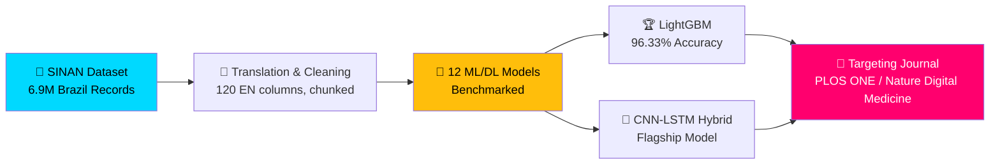
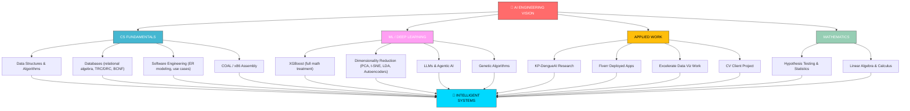

<div align="center">

<!-- Animated Header -->


</div>

<div align="center">

<!-- Typing Animation -->


</div>


<br/>

<div align="center">


</div>

<br/>

<div align="center">
  
</div>

<br/>


##  About Me

```typescript
class AIEngineeringStudent {
  constructor() {
    this.name = "Muhammad Zafran";
    this.role = "BS Artificial Intelligence Student";
    this.university = "IM|Sciences, Peshawar, Pakistan 🇵🇰";
    this.currentRole = "Data Visualization Trainee @ Excelerate (remote)";
    this.freelance = "Fiverr — muh_zafran";
    this.focus = [
      "Machine Learning & Deep Learning",
      "LLMs & Agentic AI",
      "Data Visualization (Power BI, Streamlit)",
      "Healthcare AI Research",
      "Computer Vision"
    ];
    this.community = [
      "Committee Member — PM Green Youth Movement (PMGYM)",
      "Volunteer — Qalb Welfare Foundation, Bannu",
      "AI education outreach in Bannu"
    ];
  }

  async buildIntelligentSystems() {
    while (true) {
      await this.learnFundamentals();
      await this.experiment();
      await this.ship();
      await this.teachOthers();
      console.log("📈 One more step toward the AI vision!");
    }
  }

  philosophy() {
    return "Master the fundamentals deeply, build breadth strategically, " +
           "and apply knowledge practically to create intelligent systems " +
           "that make a difference.";
  }
}

const zafran = new AIEngineeringStudent();
await zafran.buildIntelligentSystems();
```

<br clear="right"/>

### 🎯 Specialization Areas

<table>
<tr>
  <td align="center" width="25%">
    <br/>
    <b>Machine Learning</b><br/>
    <sub>Classical ML | XGBoost | Ensembles</sub>
  </td>
  <td align="center" width="25%">
    <br/>
    <b>Deep Learning</b><br/>
    <sub>CNN-LSTM | Neural Nets | Optimization</sub>
  </td>
  <td align="center" width="25%">
    <br/>
    <b>Data Visualization</b><br/>
    <sub>Power BI | EDA | Dashboards</sub>
  </td>
  <td align="center" width="25%">
    <br/>
    <b>Research (Healthcare AI)</b><br/>
    <sub>Dengue Severity Classification</sub>
  </td>
</tr>
</table>

---

## 🗣️ Languages I Speak

<div align="center">

| Language | Fluency Level | Proficiency |
|:---:|:---:|:---:|
| 🇵🇰 **Urdu** | ▰▰▰▰▰▰▰▰▰▰ | *(fill in)* |
| 🇬🇧 **English** | ▰▰▰▰▰▰▰▰▱▱ | *(fill in)* |
| **Pashto** | ▰▰▰▰▰▰▱▱▱▱ | *(fill in)* |

</div>

> ✏️ I don't have your real fluency levels on file — swap these placeholders for your actual proficiency before publishing.

---

## 💬 Connect With Me

<div align="center">

[](mailto:zafrankhaan33@gmail.com)
[](https://wa.me/923249854807)
[](https://linkedin.com/in/muhammad-zafran-93344a352)
[](https://fiverr.com/muh_zafran)

</div>

---

##  Tech Arsenal

<details open>
<summary><b>⚡ Languages & Core CS</b></summary>
<br/>

<div align="center">


</div>
</details>

<details open>
<summary><b>🧠 Machine Learning & Deep Learning</b></summary>
<br/>

<div align="center">


</div>
</details>

<details open>
<summary><b>📊 Data Visualization & Deployment</b></summary>
<br/>

<div align="center">


</div>
</details>

<details open>
<summary><b>☁️ Cloud & Platforms</b></summary>
<br/>

<div align="center">


</div>
</details>

<details open>
<summary><b>🔧 Development Tools</b></summary>
<br/>

<div align="center">


</div>
</details>

---

## 💡 AI Wisdom & Philosophy

<div align="center">

<table>
<tr>
<td align="center">

<br/>
**"AI is the new electricity."**

*— Andrew Ng*

</td>
</tr>
</table>

<br/>


<br/>

<table>
<tr>
<td align="center" width="50%">
<br/>  
<b>"Master fundamentals before frameworks"</b><br/>
<sub>Understanding the math beneath the model builds real intuition</sub>
</td>
<td align="center" width="50%">
<br/>
<b>"Trust, but verify"</b><br/>
<b>"A model is only as good as its data"</b><br/>
<sub>Clean, well-understood data beats a fancier architecture</sub>
</td>
</tr>
<tr>
<td align="center" width="50%">
<br/>
<b>"Visualize before you model"</b><br/>
<sub>EDA reveals what assumptions and metrics later depend on</sub>
</td>
<td align="center" width="50%">
<br/>
<b>"Knowledge shared is knowledge multiplied"</b><br/>
<sub>Teaching AI concepts back to the community sharpens my own</sub>
</td>
</tr>
</table>

</div>

---

## 🔥 Recent Activity & Achievements

<div align="center">

<table>
<tr>
<td align="center" width="50%">
<br/>
<b>🔍 AI/ML Research</b><br/>
<sub>Benchmarking models for dengue severity classification</sub><br/>
<sub>⚡ Refining the KP-DengueAI manuscript</sub><br/>
<sub>🎯 Focus: Healthcare AI & Journal Publication</sub>
</td>
<td align="center" width="50%">
<br/>
<b>🛠️ Application Development</b><br/>
<sub>Deploying ML apps for freelance clients</sub><br/>
<sub>⚡ Streamlit, DeepFace, Gemini API builds</sub><br/>
<sub>🎯 Focus: Computer Vision & Forecasting</sub>
</td>
</tr>
<tr>
<td align="center" width="50%">
<br/>
<b>📝 Documentation</b><br/>
<sub>Writing EDA reports & dashboard summaries</sub><br/>
<sub>⚡ Technical write-ups & data-cleaning notes</sub><br/>
<sub>🎯 Focus: Excelerate Deliverables & Research Notes</sub>
</td>
<td align="center" width="50%">
<br/>
<b>📚 Continuous Learning</b><br/>
<sub>Staying updated with the latest ML/DL techniques</sub><br/>
<sub>⚡ Mastering LLMs, RAG systems & Agentic AI</sub><br/>
<sub>🎯 Focus: Advanced Deep Learning & Computer Vision</sub>
</td>
</tr>
</table>

</div>

---


## 🏅 Achievements

<div align="center">

```
╔════════════════════════════════════════════════════════════════╗
║  🎓  Certified: Excelerate Data Visualization Traineeship      ║
║  🎓  Certified: Arch Technologies ML Internship                ║
║  🧬  KP-DengueAI: LightGBM model — 96.33% accuracy             ║
║  💼  4 SEO-optimized, active Fiverr gigs                       ║
║  🚀  Two deployed Streamlit apps in production                 ║
║  📢  100+ students helped through knowledge sharing            ║
╚════════════════════════════════════════════════════════════════╝
```

<table align="center">
<tr>
<td align="center" width="33%">
<br/>
<b>🔥 Try Harder</b><br/>
<sub>Official Offensive Security Motto</sub>
</td>
<td align="center" width="33%">
<br/>
<b>⚡ Industry Standard</b><br/>
<sub>Recognized Worldwide</sub>
</td>
<td align="center" width="33%">
<br/>
<b>⏰ 24-Hour Exam</b><br/>
<sub>Practical Hands-on Test</sub>
</td>
</tr>
</table>

</div>

---

## 📊 GitHub Contribution Stats & Analytics

<div align="center">
  
  
</div>

<br/>

<div align="center">
  <a href="https://github.com/MuhammadZafran33">
    
  </a>
</div>

<br/>

<div align="center">
  <a href="https://github.com/MuhammadZafran33">
    
  </a>
</div>

<br/>

<div align="center">
  
  
</div>

<br/>

<div align="center">
  
  
</div>

> 📝 Note: `github-readme-stats` and `capsule-render` cards only reflect **public** repositories accurately — private repos won't show in these counts.

---

## 🎓 Knowledge Base & Resources

<div align="center">

### 📚 My AI/ML Arsenal

<table>
<tr>
<td align="center" width="33%">
<br/>
<b>Machine Learning</b><br/>
<sub>• Regression & Classification</sub><br/>
<sub>• Ensemble Methods (XGBoost math)</sub><br/>
<sub>• Model Evaluation Metrics</sub>
</td>
<td align="center" width="33%">
<br/>
<b>Deep Learning</b><br/>
<sub>• Neural Network Fundamentals</sub><br/>
<sub>• CNN-LSTM Hybrid Architectures</sub><br/>
<sub>• Batch Normalization & Optimization</sub>
</td>
<td align="center" width="33%">
<br/>
<b>LLMs & Agentic AI</b><br/>
<sub>• Transformer Architecture</sub><br/>
<sub>• LangChain + Gemini Pipelines</sub><br/>
<sub>• Prompt-Driven Chatbots</sub>
</td>
</tr>
<tr>
<td align="center" width="33%">
<br/>
<b>Computer Vision</b><br/>
<sub>• Real-Time Emotion Detection</sub><br/>
<sub>• Video-Based Event Detection</sub><br/>
<sub>• Alerting Systems</sub>
</td>
<td align="center" width="33%">
<br/>
<b>Data Visualization</b><br/>
<sub>• Exploratory Data Analysis</sub><br/>
<sub>• Power BI Dashboards</sub><br/>
<sub>• Streamlit App Deployment</sub>
</td>
<td align="center" width="33%">
<br/>
<b>Research Methodology</b><br/>
<sub>• Hypothesis Testing & Statistics</sub><br/>
<sub>• Dataset Engineering at Scale</sub><br/>
<sub>• Academic Manuscript Preparation</sub>
</td>
</tr>
</table>

</div>

---

## 🌐 Platforms & Recognition

<div align="center">

<table>
<tr>
<td align="center" width="25%">
<br/>
<b>Fiverr</b><br/>
<sub>🏆 Active Freelancer</sub><br/>
<sub>⭐ 4 Live Gigs</sub><br/>
<sub>💼 Deployed ML Apps</sub>
</td>
<td align="center" width="25%">
<br/>
<b>GitHub</b><br/>
<sub>🏆 22+ Repositories</sub><br/>
<sub>⭐ 25+ Stars</sub><br/>
<sub>📈 150+ Commits</sub>
</td>
<td align="center" width="25%">
<br/>
<b>Kaggle</b><br/>
<sub>📓 Notebooks & Datasets</sub><br/>
<sub>🔬 Model Experiments</sub>
</td>
<td align="center" width="25%">
<br/>
<b>LinkedIn</b><br/>
<sub>🤝 Professional Network</sub><br/>
<sub>📢 Career Updates</sub>
</td>
</tr>
</table>

### 🎯 Certified & Trained By


</div>

---

### 🌐 Learning Communities


</div>

---

## 🛠️ Open Source Contributions

<div align="center">

### 🌟 Featured Projects

<table>
<tr>
<td align="center" width="50%">
<br/>
<b>📊 Data-Structures-Lab-Solutions</b><br/>
15+ implementations: linked lists, trees/graphs, sorting, complexity analysis<br/>


</td>
<td align="center" width="50%">
<br/>
<b>🤖 Machine-Learning-Journey</b><br/>
Supervised/unsupervised learning, neural nets, deep learning experiments<br/>


</td>
</tr>
<tr>
<td align="center" width="50%">
<br/>
<b>🔧 C++-Lab-Projects</b><br/>
Algorithm optimization, system programs, network programming<br/>


</td>
<td align="center" width="50%">
<br/>
<b>🌐 Web-Development-Notebook</b><br/>
HTML fundamentals, CSS mastery, responsive design, interactive components<br/>


</td>
</tr>
<tr>
<td align="center" width="50%">
<br/>
<b>📖 Tony-Gaddis-Solutions</b><br/>
50+ Python solutions covering OOP, file operations, algorithms<br/>


</td>
<td align="center" width="50%">
  
<br/>
  
<b>🧠 nn-zero-to-hero</b><br/>
Neural networks from scratch, following Andrej Karpathy's course<br/>


</td>
</tr>
</table>

</div>

---

### 🤝 Open for Collaboration On

<table>
<tr>
<td align="center" width="33%">
<br/>
<b>🔬 Research Collaboration</b><br/>
<sub>Healthcare AI</sub><br/>
<sub>Model Benchmarking</sub><br/>
<sub>Paper Co-Authoring</sub>
</td>
<td align="center" width="33%">
<br/>
<b>🛠️ Open Source</b><br/>
<sub>ML/DL Projects</sub><br/>
<sub>App Deployment</sub><br/>
<sub>Community Projects</sub>
</td>
<td align="center" width="33%">
<br/>
<b>🎓 Knowledge Sharing</b><br/>
<sub>Mentoring Students</sub><br/>
<sub>AI Education (Bannu)</sub><br/>
<sub>Peer Learning</sub>
</td>
</tr>
</table>

<br/>

### 📧 Reach Out

[](mailto:zafrankhaan33@gmail.com)
[](https://wa.me/923249854807)
[](https://linkedin.com/in/muhammad-zafran-93344a352)

---
**💡 Available for:**
- 📊 Data Visualization & Dashboard Consulting
- 🤖 ML/DL Freelance Project Collaboration
- 🛠️ Custom App Development (Streamlit, Chatbots, Forecasting)
- 📚 AI Concept Tutoring & Study Group Sessions
- 🗣️ Community AI Talks & Workshops (Bannu outreach)

---
## 🎮 AI/ML Practice Platforms

<div align="center">

<table>
<tr>
<td align="center" width="20%">
<br/>
<b>Kaggle</b><br/>
<sub>📓 Notebooks</sub><br/>
<sub>⭐ Practice & Experiments</sub>
</td>
<td align="center" width="20%">
<br/>
<b>Google Colab</b><br/>
<sub>🔬 Model Experiments</sub><br/>
<sub>⭐ GPU Prototyping</sub>
</td>
<td align="center" width="20%">
<br/>
<b>WsCube Tech</b><br/>
<sub>🎓 Data Science Course</sub><br/>
<sub>⭐ Completed Modules</sub>
</td>
<td align="center" width="20%">
<br/>
<b>nn-zero-to-hero</b><br/>
<sub>🧠 Andrej Karpathy</sub><br/>
<sub>⭐ In Progress</sub>
</td>
<td align="center" width="20%">
<br/>
<b>GitHub</b><br/>
<sub>💻 22+ Repositories</sub><br/>
<sub>⭐ 25+ Stars</sub>
</td>
</tr>
</table>

</div>

---
## 🎯 2026 Roadmap

<div align="center">

╔═══════════════════════════════════════════════════════════════════╗
║                    🚀 AI ENGINEERING ROADMAP                       ║
╠═══════════════════════════════════════════════════════════════════╣
║  2024–2025 — Foundations (70% Complete)                            ║
║  ├─ ✅ DSA Mastery                                                  ║
║  ├─ ✅ C++ Proficiency                                              ║
║  ├─ 🔄 ML Basics                                                    ║
║  └─ 🔄 OS Concepts                                                  ║
║  2025–2026 — Specialization (In Progress)                          ║
║  ├─ 🧠 Deep Learning                                                ║
║  ├─ 👁️ Computer Vision                                              ║
║  ├─ 🔗 LLMs & RAG Systems                                           ║
║  └─ 🤖 Agentic AI (Next Up, InshaAllah)                             ║
║  2026–2027 — Research & Innovation                                 ║
║  ├─ 📄 KP-DengueAI Publication                                     ║
║  ├─ 🚨 Computer Vision Client Delivery                              ║
║  └─ 🌟 Open-Source Contribution Growth                              ║
║  2027+ — Community & Leadership                                    ║
║  ├─ 🎓 AI Education Advocacy in Bannu                               ║
║  └─ 🤝 Mentorship & Knowledge Sharing                               ║
╚═══════════════════════════════════════════════════════════════════╝

</div>
---
## 🔥 Fun Facts & Stats (icons added)

 Lines of Code
 Commits
 Problems Solved
 Students Helped

---

## 🔬 Research Spotlight — KP-DengueAI Framework

<div align="center">



</div>

- **Goal:** Three-class dengue severity classification benchmarking 12 ML/DL models
- **Best result:** LightGBM — 96.33% accuracy, AUC-ROC 0.9947, MCC 0.9043, 99.09% Severe Dengue recall
- **Flagship architecture:** CNN-LSTM Hybrid with dual-branch fusion, alongside XGBoost, RF, LR, NB, SVM, LSTM, GRU, CNN
- **Collaborators:** Co-authored with **Hilal Ahmad Khan**, supervised by **Lect. Ali Haider**
- **Status:** Manuscript through multiple editorial revisions — corrected feature counts (95 features), sequential table numbering, added Ethics Statement & CRediT Author Contributions; next step is full EDA on the translated dataset

---

## 🚨 Client Project — Street Conflict Detection

<div align="center">

```
╔══════════════════════════════════════════════════════════════╗
║   INPUT:  Uploaded video of a street conflict                 ║
║   ├─ Detect: wounded person   (color-coded overlay)           ║
║   ├─ Detect: attacker          (color-coded overlay)          ║
║   ├─ Detect: weapon / knife    (color-coded overlay)          ║
║   └─ Trigger: emergency-services alert, in real time          ║
║                                                                 ║
║   Scope: $10,000+ end-to-end computer vision & deep learning  ║
╚══════════════════════════════════════════════════════════════╝
```

</div>

---

## 💼 Freelance Work (Fiverr — `muh_zafran`)

Built out a Fiverr presence from the ground up — profile auditing, SEO-optimized gigs, custom cover art, and a portfolio of deployed applications:

<div align="center">

| App | Stack | Notes |
|:---|:---|:---|
| Diabetes Prediction | Streamlit | `zafii-diabetes-prediction.streamlit.app` |
| Sentiment Analysis | Streamlit | `zafran-sentiment-analysis-app.streamlit.app` |
| Real-Time Emotion Detection | DeepFace | Detects 7 emotions live |
| AI Chatbot | Gemini API | Conversational assistant |
| Sales Forecasting | Facebook Prophet | 89.45% accuracy on Walmart sales data |

</div>

---

## 🏢 Internship Track Record

<div align="center">

| Internship | Highlights |
|:---|:---|
| **Excelerate — Data Visualization Trainee** | EDA + data cleaning reports, Power BI dashboard, 12-slide branded presentation for a DePaul University international-applicant dataset; fully completed & certified |
| **Arch Technologies — ML Internship** | 98.6% spam detection accuracy, 99.2% MNIST digit recognition accuracy; completed & certified |

</div>

---

## 📚 Certifications

<div align="center">


*Plus 10+ additional certifications across AI, cloud, and data tooling.*

</div>

---

## 🌱 Community & Advocacy

<div align="center">

<table>
<tr>
<td align="center" width="33%">
<b>🌿 PM Green Youth Movement</b><br/>
<sub>Committee Member</sub>
</td>
<td align="center" width="33%">
<b>🤝 Qalb Welfare Foundation, Bannu</b><br/>
<sub>Community welfare volunteer</sub>
</td>
<td align="center" width="33%">
<b>📢 AI Education Outreach</b><br/>
<sub>Promoting AI literacy in Bannu</sub>
</td>
</tr>
</table>

</div>

---

## 🧠 Knowledge Architecture



---

## 🎯 Near-Term Goals & Roadmap

<div align="center">

```
╔═══════════════════════════════════════════════════════════════════╗
║                    🚀 GOALS ROADMAP                                ║
╠═══════════════════════════════════════════════════════════════════╣
║                                                                     ║
║  Research                                                          ║
║  ├─ 🧬 Finish EDA on the full translated SINAN dataset             ║
║  ├─ 📄 Submit the KP-DengueAI manuscript for journal review        ║
║  └─ 🔬 Deepen CNN-LSTM hybrid architecture work                    ║
║                                                                     ║
║  Applied / Client Work                                             ║
║  ├─ 🚨 Deliver the street-conflict computer-vision project          ║
║  ├─ 💼 Grow the Fiverr gig portfolio                                ║
║  └─ 📊 Complete remaining Excelerate deliverables                  ║
║                                                                     ║
║  Learning                                                          ║
║  ├─ 🧠 Go deeper into LLMs & Agentic AI                            ║
║  ├─ 👁️ Build stronger Computer Vision fundamentals                 ║
║  └─ 🤖 Continue Karpathy's nn-zero-to-hero series                  ║
║                                                                     ║
║  Community                                                         ║
║  ├─ 📢 Keep promoting AI education in Bannu                        ║
║  └─ 🌿 Stay active with PMGYM & Qalb Welfare Foundation             ║
║                                                                     ║
╚═══════════════════════════════════════════════════════════════════╝
```

</div>

---

## 🔥 Fun Facts & Stats

<div align="center">

<table>
<tr>
<td align="center" width="25%">
<b>💻 Lines of Code</b><br/>
<sub>2,500+ written</sub><br/>
<sub>Mostly Python & C++</sub>
</td>
<td align="center" width="25%">
<b>📈 Commits</b><br/>
<sub>150+ regular contributions</sub><br/>
<sub>Across 22+ repositories</sub>
</td>
<td align="center" width="25%">
<b>🧩 Problems Solved</b><br/>
<sub>200+ continuous practice</sub><br/>
<sub>DSA & algorithms</sub>
</td>
<td align="center" width="25%">
<b>🎓 Students Helped</b><br/>
<sub>100+ through knowledge sharing</sub><br/>
<sub>READMEs, notes, mentoring</sub>
</td>
</tr>
</table>

### 📊 Research & Build Workflow

```
    ┌───────────────────────┐
    │  Problem Definition   │
    └──────────┬────────────┘
               │
    ┌──────────▼────────────┐
    │ Data Collection &     │
    │ Cleaning              │
    └──────────┬────────────┘
               │
    ┌──────────▼────────────┐
    │ Exploratory Analysis  │
    │ (EDA)                 │
    └──────────┬────────────┘
               │
    ┌──────────▼────────────┐
    │  Model Building        │
    └──────────┬────────────┘
               │
    ┌──────────▼────────────┐
    │ Evaluation & Tuning   │
    └──────────┬────────────┘
               │
    ┌──────────▼────────────┐
    │  Deployment             │
    │ (Streamlit / Power BI) │
    └──────────┬────────────┘
               │
    ┌──────────▼────────────┐
    │ Documentation &        │
    │ Sharing                │
    └─────────────────────────┘
```

</div>

---

## 📊 GitHub Statistics

```
╔═══════════════════════════════════════════════════════╗
║              GITHUB ANALYTICS                          ║
╠═══════════════════════════════════════════════════════╣
║ Public Repositories:      22+                          ║
║ Total Commits:            150+                         ║
║ Code Contributions:       2,500+ lines                 ║
║ Followers:                21+                          ║
║ Following:                50+                          ║
║ Stars Received:           25+                          ║
║ Most Used Language:       C++ / Python                 ║
║ Repositories Updated:     Regularly 🔄                 ║
╚═══════════════════════════════════════════════════════╝
```

---

## 🌟 Support My Work

If you find my repositories helpful:
- ⭐ **Star** my repositories
- 🔄 **Fork** and contribute
- 📢 **Share** with others
- 💬 **Discuss** ideas
- 🤝 **Collaborate** on projects

---

<div align="center">


### 🌟 Quick Links Navigation

<table align="center">
<tr>
<td align="center">
<a href="#-about-me"></a>
</td>
<td align="center">
<a href="#-tech-arsenal"></a>
</td>
<td align="center">
<a href="#-certifications"></a>
</td>
<td align="center">
<a href="#-research-spotlight--kp-dengueai-framework"></a>
</td>
<td align="center">
<a href="#-connect-with-me"></a>
</td>
</tr>
</table>

</div>

---

### 🎓 AI Researcher & Educator's Creed

```
╔════════════════════════════════════════════════════════════════════╗
║                                                                      ║
║   I will build systems that inform and help, not mislead or harm.  ║
║                                                                      ║
║   I will ground my models in clean data and honest evaluation,      ║
║   not in numbers that only look good on a slide.                    ║
║                                                                      ║
║   I will document my work so others can learn from it.              ║
║                                                                      ║
║   I will share what I know with my community in Bannu               ║
║   and beyond, because knowledge multiplies when it's shared.        ║
║                                                                      ║
║   I am a student first, and I will stay one.                        ║
║                                                                      ║
╚════════════════════════════════════════════════════════════════════╝
```

<div align="center">


### 💭 Final Thoughts

*"Master the fundamentals deeply, build breadth strategically, and apply knowledge*
*practically to create intelligent systems that make a difference."*

**— Muhammad Zafran**

<br/>


<br/><br/>

[](https://star-history.com/#MuhammadZafran33/MuhammadZafran33&Date)

<br/><br/>


<br/><br/>

<sub>📍 Peshawar, Khyber Pakhtunkhwa, Pakistan 🇵🇰 | Last Updated: August 2026</sub>

</div>
