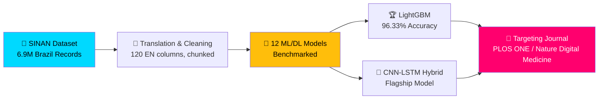
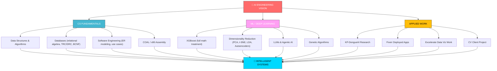

<div align="center">

<!-- Animated Header -->


</div>

<div align="center">

<!-- Typing Animation -->


</div>

<!-- Glowing Divider -->


<br/>

<div align="center">


</div>

<br/>


##  About Me

```typescript
class AIEngineeringStudent {
  constructor() {
    this.name = "Muhammad Zafran";
    this.role = "BS Artificial Intelligence Student";
    this.university = "IM|Sciences, Peshawar, Pakistan 🇵🇰";
    this.currentRole = "Data Visualization Trainee @ Excelerate (remote)";
    this.freelance = "Fiverr — muh_zafran";
    this.focus = [
      "Machine Learning & Deep Learning",
      "LLMs & Agentic AI",
      "Data Visualization (Power BI, Streamlit)",
      "Healthcare AI Research",
      "Computer Vision"
    ];
    this.community = [
      "Committee Member — PM Green Youth Movement (PMGYM)",
      "Volunteer — Qalb Welfare Foundation, Bannu",
      "AI education outreach in Bannu"
    ];
  }

  async buildIntelligentSystems() {
    while (true) {
      await this.learnFundamentals();
      await this.experiment();
      await this.ship();
      await this.teachOthers();
      console.log("📈 One more step toward the AI vision!");
    }
  }

  philosophy() {
    return "Master the fundamentals deeply, build breadth strategically, " +
           "and apply knowledge practically to create intelligent systems " +
           "that make a difference.";
  }
}

const zafran = new AIEngineeringStudent();
await zafran.buildIntelligentSystems();
```

<br clear="right"/>

### 🎯 Focus Areas

<table>
<tr>
  <td align="center" width="25%">
    <br/>
    <b>Machine Learning</b><br/>
    <sub>Classical ML | XGBoost | Ensembles</sub>
  </td>
  <td align="center" width="25%">
    <br/>
    <b>Deep Learning</b><br/>
    <sub>CNN-LSTM | LLMs | Agentic AI</sub>
  </td>
  <td align="center" width="25%">
    <br/>
    <b>Data Visualization</b><br/>
    <sub>Power BI | EDA | Dashboards</sub>
  </td>
  <td align="center" width="25%">
    <br/>
    <b>Healthcare AI Research</b><br/>
    <sub>Dengue Severity Classification</sub>
  </td>
</tr>
</table>

---

## 💬 Connect With Me

<div align="center">

[](mailto:zafrankhaan33@gmail.com)
[](https://wa.me/923249854807)
[](https://linkedin.com/in/muhammad-zafran-93344a352)
[](https://fiverr.com/muh_zafran)

</div>

---

##  Tech Arsenal

<details open>
<summary><b>⚡ Languages & Core CS</b></summary>
<br/>

<div align="center">


</div>
</details>

<details open>
<summary><b>🧠 Machine Learning & Deep Learning</b></summary>
<br/>

<div align="center">


</div>
</details>

<details open>
<summary><b>📊 Data Visualization & Deployment</b></summary>
<br/>

<div align="center">


</div>
</details>

<details open>
<summary><b>🔧 Tools & Platforms</b></summary>
<br/>

<div align="center">


</div>
</details>

---

## 📊 GitHub Analytics

<div align="center">
  
  
</div>

<br/>

<div align="center">
  <a href="https://github.com/MuhammadZafran33">
    
  </a>
</div>

> 📝 Note: `github-readme-stats` cards render fully only for public repositories — private repos won't reflect in the counts above.

---

## 🎓 Current Roles

<div align="center">

| Role | Where | What it Involves |
|:---|:---|:---|
| **AI Undergraduate** | IM\|Sciences, Peshawar | Semester IV: AI, Database Systems, DSA, Software Engineering, COAL |
| **Data Visualization Trainee** | Excelerate (remote internship) | EDA reports, data cleaning, Power BI dashboards, stakeholder presentations |
| **Freelancer** | Fiverr (`muh_zafran`) | ML app deployment, dashboards, data science gigs |
| **Committee Member** | PM Green Youth Movement (PMGYM) | Youth-led environmental & civic engagement |
| **Volunteer** | Qalb Welfare Foundation, Bannu | Community welfare work + AI education outreach |

</div>

---

## 🔬 Research Spotlight — KP-DengueAI Framework

<div align="center">



</div>

- **Goal:** Three-class dengue severity classification benchmarking 12 ML/DL models
- **Best result:** LightGBM — 96.33% accuracy, AUC-ROC 0.9947, MCC 0.9043, 99.09% Severe Dengue recall
- **Flagship architecture:** CNN-LSTM Hybrid with dual-branch fusion, alongside XGBoost, RF, LR, NB, SVM, LSTM, GRU, CNN
- **Collaborators:** Co-authored with **Hilal Ahmad Khan**, supervised by **Lect. Ali Haider**
- **Status:** Manuscript through multiple editorial revisions — corrected feature counts (95 features), sequential table numbering, added Ethics Statement & CRediT Author Contributions; next step is full EDA on the translated dataset

---

## 🚀 Featured Projects

<table>
<tr>
<td align="center" width="50%">
<b>🧬 KP-DengueAI Framework</b><br/>
Dengue severity classification research<br/>
<sub>12 ML/DL models • Journal submission in progress</sub><br/>


</td>
<td align="center" width="50%">
<b>🚨 Street Conflict Detection (Client Project)</b><br/>
CV/DL system to flag wounded persons, attackers & weapons from video, with emergency alerting<br/>
<sub>$10,000+ scope • End-to-end build</sub><br/>


</td>
</tr>
<tr>
<td align="center" width="50%">
<b>📊 Data-Structures-Lab-Solutions</b><br/>
15+ implementations: linked lists, trees/graphs, sorting, complexity analysis<br/>

</td>
<td align="center" width="50%">
<b>🤖 Machine-Learning-Journey</b><br/>
Supervised/unsupervised learning, neural nets, deep learning experiments<br/>

</td>
</tr>
<tr>
<td align="center" width="50%">
<b>🧠 nn-zero-to-hero</b><br/>
Neural networks from scratch, following Andrej Karpathy's course<br/>

</td>
<td align="center" width="50%">
<b>📖 Tony-Gaddis-Solutions</b><br/>
50+ Python solutions covering OOP, file operations, algorithms<br/>

</td>
</tr>
</table>

---

## 💼 Freelance Work (Fiverr — `muh_zafran`)

Built out a Fiverr presence from the ground up — profile auditing, SEO-optimized gigs, custom cover art, and a portfolio of deployed applications:

<div align="center">

| App | Stack | Notes |
|:---|:---|:---|
| Diabetes Prediction | Streamlit | `zafii-diabetes-prediction.streamlit.app` |
| Sentiment Analysis | Streamlit | `zafran-sentiment-analysis-app.streamlit.app` |
| Real-Time Emotion Detection | DeepFace | Detects 7 emotions live |
| AI Chatbot | Gemini API | Conversational assistant |
| Sales Forecasting | Facebook Prophet | 89.45% accuracy on Walmart sales data |

</div>

---

## 🏢 Internship Track Record

<div align="center">

| Internship | Highlights |
|:---|:---|
| **Excelerate — Data Visualization Trainee** | EDA + data cleaning reports, Power BI dashboard, 12-slide branded presentation for a DePaul University international-applicant dataset; fully completed & certified |
| **Arch Technologies — ML Internship** | 98.6% spam detection accuracy, 99.2% MNIST digit recognition accuracy; completed & certified |

</div>

---

## 📚 Certifications

<div align="center">


*Plus 10+ additional certifications across AI, cloud, and data tooling.*

</div>

---

## 🌱 Community & Advocacy

<div align="center">

<table>
<tr>
<td align="center" width="33%">
<b>🌿 PM Green Youth Movement</b><br/>
<sub>Committee Member</sub>
</td>
<td align="center" width="33%">
<b>🤝 Qalb Welfare Foundation, Bannu</b><br/>
<sub>Community welfare volunteer</sub>
</td>
<td align="center" width="33%">
<b>📢 AI Education Outreach</b><br/>
<sub>Promoting AI literacy in Bannu</sub>
</td>
</tr>
</table>

</div>

---

## 🧠 Knowledge Architecture



---

<div align="center">


### 💭 Philosophy

*"Master the fundamentals deeply, build breadth strategically, and apply knowledge*
*practically to create intelligent systems that make a difference."*

**— Muhammad Zafran**

<br/>


<br/><br/>

<sub>📍 Peshawar, Khyber Pakhtunkhwa, Pakistan 🇵🇰 | Last Updated: August 2026</sub>

</div>
