<div align="center">

# 🤖 **MUHAMMAD ZAFRAN** 🤖


[](https://github.com/MuhammadZafran33)
[](https://github.com/MuhammadZafran33)

</div>

---

# 📌 Quick Overview

<div align="center">

**🎓 4th Semester AI Student** | **IMSciences, Peshawar** | **Pakistan 🇵🇰**

*"Mastering Fundamentals Today to Build Intelligent Systems Tomorrow"*

</div>

---

## 📊 Technical Skills Dashboard


### Skill Summary:
- **Advanced:** C++ (80%), Data Structures (85%), Algorithms (80%)
- **Intermediate-Advanced:** Python (75%), Mathematics (80%)
- **Intermediate:** NumPy/Pandas (70%), Linux (65%), Git (80%)
- **Learning:** TensorFlow (55%), Deep Learning (55%), NLP (45%)

---

# 🧠 Knowledge Architecture

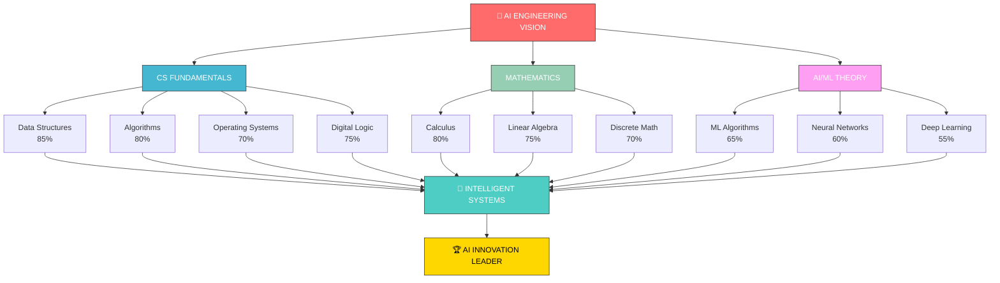

---

# 📈 Learning Progress Roadmap


## Timeline Breakdown:

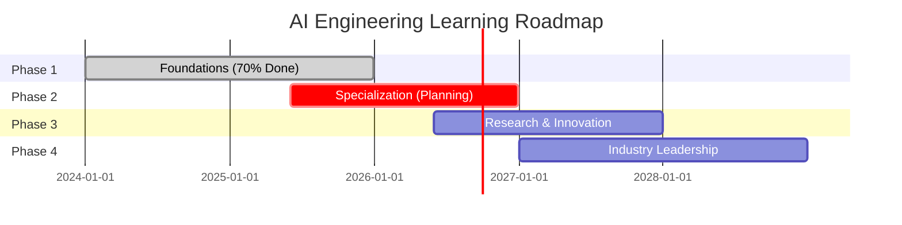

---

# 📊 Repository Statistics


### GitHub Metrics:
- **22+ Repositories** - Across multiple domains
- **150+ Commits** - Regular contributions
- **2500+ Lines of Code** - Clean, documented code
- **25+ Stars** - Community appreciation
- **21+ Followers** - Growing community
- **200+ Problems Solved** - Continuous practice
- **100+ Students Helped** - Knowledge sharing

---

# 🚀 Project Breakdown


### Featured Projects:

#### 1️⃣ **Data-Structures-Lab-Solutions** ⭐⭐⭐⭐⭐
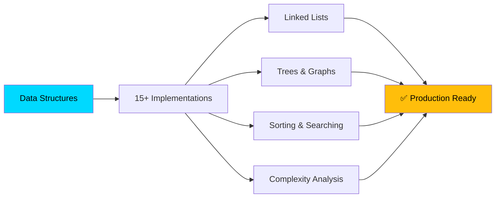

**Status:** ✅ Complete | **Language:** C++ | **Complexity:** ⭐⭐⭐⭐⭐

#### 2️⃣ **Machine-Learning-Journey** 🤖
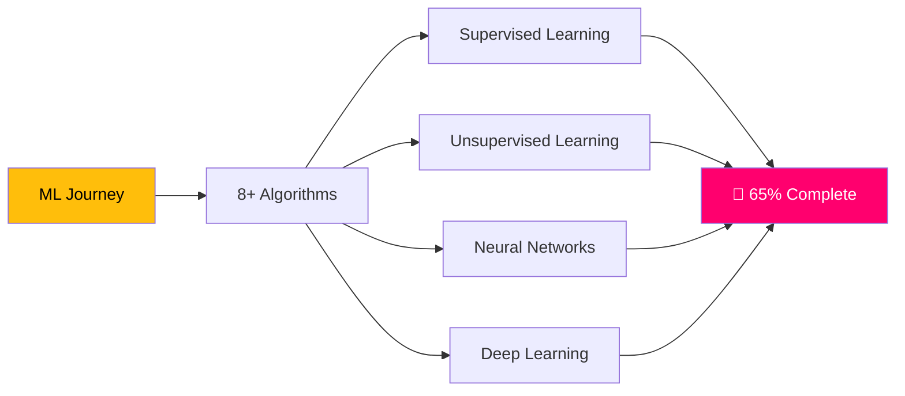

**Status:** 🔄 In Progress | **Language:** Python | **Tools:** NumPy, Pandas, TensorFlow

#### 3️⃣ **C++-Lab-Projects** 🔧
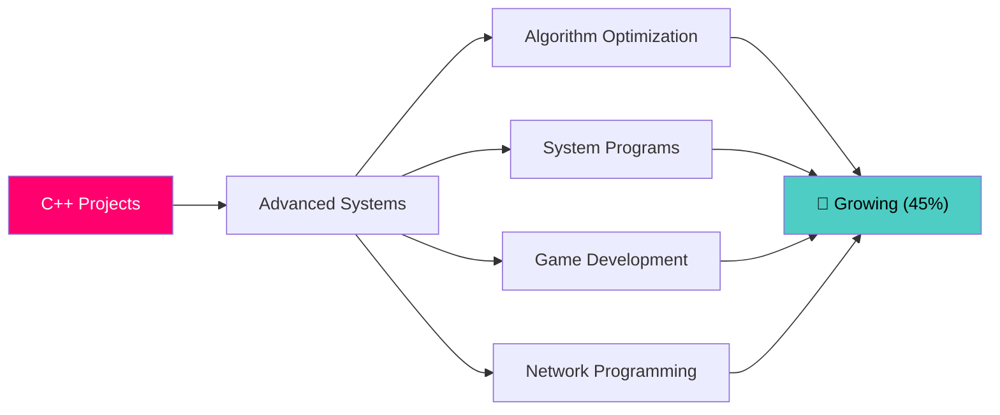

**Status:** 🔄 Active | **Language:** C++ | **Complexity:** ⭐⭐⭐⭐⭐

#### 4️⃣ **Web-Development-Notebook** 🌐
**Contents:** HTML Fundamentals | CSS Mastery | Responsive Design | Interactive Components

#### 5️⃣ **Tony-Gaddis-Solutions** 📖
**Contents:** 50+ Python Solutions | OOP Concepts | File Operations | Algorithms

#### 6️⃣ **nn-zero-to-hero** 🧠
**Status:** 🔄 In Progress (40%) | **Focus:** Neural Networks from Scratch | **Instructor:** Andrej Karpathy

---

## 🏆 Key Achievements

### Achievement Metrics:

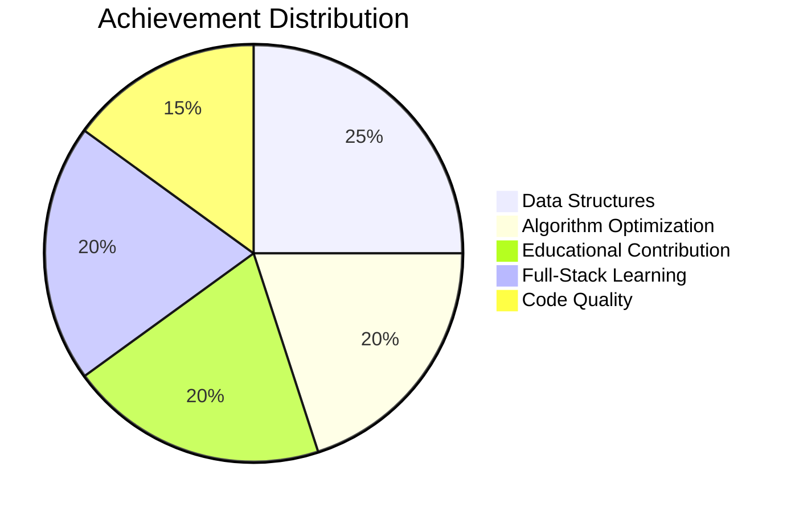

---

## 🎯 Learning Path & Milestones

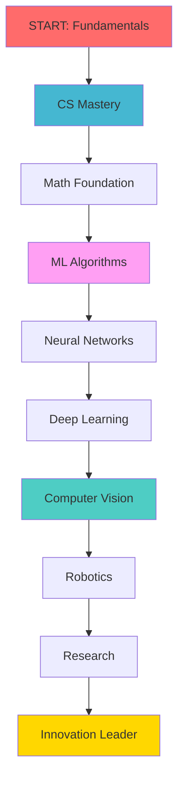

---

## 💻 Tech Stack & Tools


```mermaid
graph LR
    A["📚 START Fundamentals"] --> B["🧠 DATA STRUCTURES 85%"]
    B --> C["⚙️ ALGORITHMS 80%"]
    C --> D["📐 MATHEMATICS 80%"]
    D --> E["🤖 ML BASICS 70%"]
    E --> F["🧠 NEURAL NETS 60%"]
    F --> G["🚀 DEEP LEARNING 55%"]
    G --> H["👁️ COMPUTER VISION 50%"]
    H --> I["🏆 AI EXPERT Mastery"]
    
    style A fill:#ff6b6b,color:#fff,stroke:#000,stroke-width:2px
    style B fill:#45b7d1,color:#fff,stroke:#000,stroke-width:2px
    style C fill:#45b7d1,color:#fff,stroke:#000,stroke-width:2px
    style D fill:#96ceb4,color:#fff,stroke:#000,stroke-width:2px
    style E fill:#ff9ff3,color:#fff,stroke:#000,stroke-width:2px
    style F fill:#ff9ff3,color:#fff,stroke:#000,stroke-width:2px
    style G fill:#ff9ff3,color:#fff,stroke:#000,stroke-width:2px
    style H fill:#ff9ff3,color:#fff,stroke:#000,stroke-width:2px
    style I fill:#ffd700,color:#000,stroke:#000,stroke-width:3px
```
---

## 📈 Current Status & Progress

### Overall Learning Progress: **70% Complete**

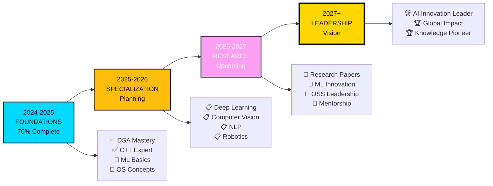

### Module Breakdown:

| Module | Progress | Status | Complexity |
|:---|:---:|:---|:---:|
| Data Structures | 85% | ✅ Excellent | ⭐⭐⭐⭐⭐ |
| Algorithms | 80% | ✅ Excellent | ⭐⭐⭐⭐ |
| Mathematics | 80% | ✅ Excellent | ⭐⭐⭐⭐ |
| Operating Systems | 70% | 🔄 In Progress | ⭐⭐⭐⭐ |
| Digital Logic | 75% | ✅ Strong | ⭐⭐⭐⭐ |
| Machine Learning | 65% | 🔄 Active Learning | ⭐⭐⭐⭐ |
| Deep Learning | 55% | 🔄 Learning | ⭐⭐⭐⭐⭐ |
| **Overall** | **70%** | **🔄 Active** | **⭐⭐⭐⭐** |

---

## 🔄 Current & Upcoming Projects

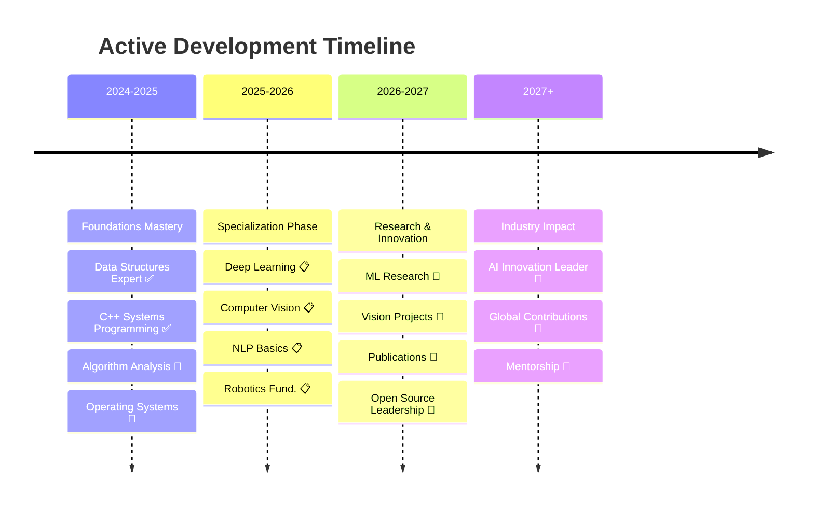

---

## 👥 Collaboration & Community

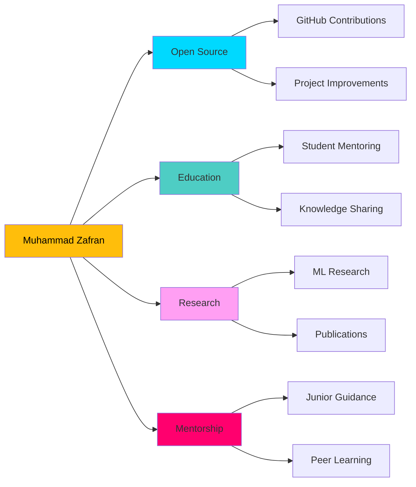

---

## 🌟 Vision & Philosophy

<div align="center">

### Core Philosophy

> **"Master the fundamentals deeply, build breadth strategically, and apply knowledge practically to create intelligent systems that make a difference in the world."**

### Core Values

| Value | Application | Evidence |
|:---|:---|:---|
| **Excellence** | High-quality, documented code | Well-structured repos |
| **Consistency** | Regular practice & contribution | 150+ commits |
| **Curiosity** | Exploring new tech & methods | Diverse projects |
| **Collaboration** | Knowledge sharing & helping | Student mentoring |
| **Innovation** | Creative problem-solving | Optimized algorithms |
| **Integrity** | Honest work & attribution | Proper credits |

</div>

---

## 📞 Connect With Me

<div align="center">

### 🔗 Let's Connect!

[](mailto:zafrankhaan33@gmail.com)
[](https://wa.me/923249854807)
[](https://linkedin.com/in/muhammad-zafran-93344a352)
[](https://github.com/MuhammadZafran33)

### 🎯 Open To:
- 🤝 Collaboration on AI/ML projects
- 💼 Internship opportunities in AI/Robotics
- 🔬 Research contribution
- 👨‍🏫 Mentorship (both ways!)
- 🌐 Open source contribution

### 📍 Location
**Peshawar, Khyber Pakhtunkhwa, Pakistan 🇵🇰**

</div>

---

## 📊 GitHub Statistics

```
╔═══════════════════════════════════════════════════════╗
║              GITHUB ANALYTICS                         ║
╠═══════════════════════════════════════════════════════╣
║ Public Repositories:      22+                         ║
║ Total Commits:            150+                        ║
║ Code Contributions:       2500+ lines                 ║
║ Documentation:            500+ KB                     ║
║ Followers:                21+                         ║
║ Following:                50+                         ║
║ Stars Received:           25+                         ║
║ Last Active:              This Week ⚡               ║
║ Most Used Language:       C++ / Python                ║
║ Repositories Updated:     Regularly 🔄               ║
╚═══════════════════════════════════════════════════════╝
```

---

## 🌟 Support My Work

If you find my repositories helpful:
- ⭐ **Star** my repositories
- 🔄 **Fork** and contribute
- 📢 **Share** with others
- 💬 **Discuss** ideas
- 🤝 **Collaborate** on projects

---

<div align="center">

```
╔═════════════════════════════════════════════════════════╗
║      Thank You for Visiting My GitHub Profile!         ║
║                                                         ║
║  "Mastering fundamentals today to build intelligent    ║
║   systems tomorrow"                                     ║
║                                                         ║
║  Let's collaborate on amazing projects that push the   ║
║  boundaries of AI and computer science!                ║
╚═════════════════════════════════════════════════════════╝
```

**Last Updated:** February 2026 | **Status:** Active & Growing 📈 | **Passion:** 🔥🔥🔥🔥🔥

**Made with ❤️ by Muhammad Zafran | Peshawar, Pakistan 🇵🇰**

</div>
