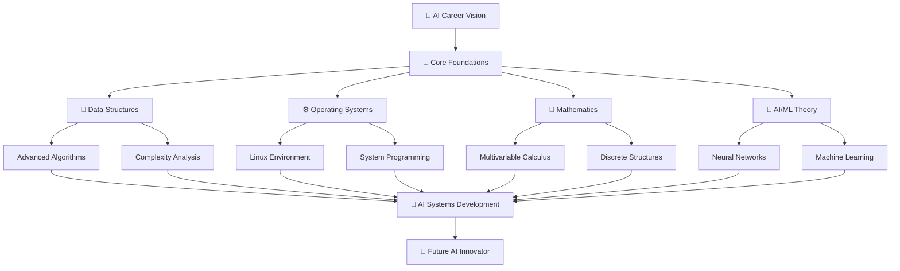
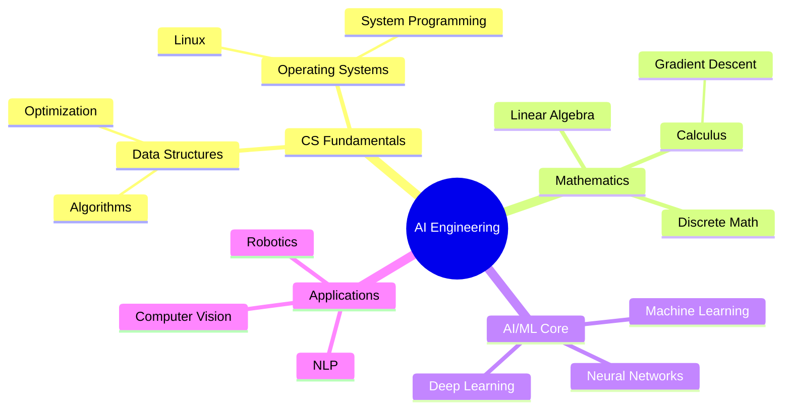
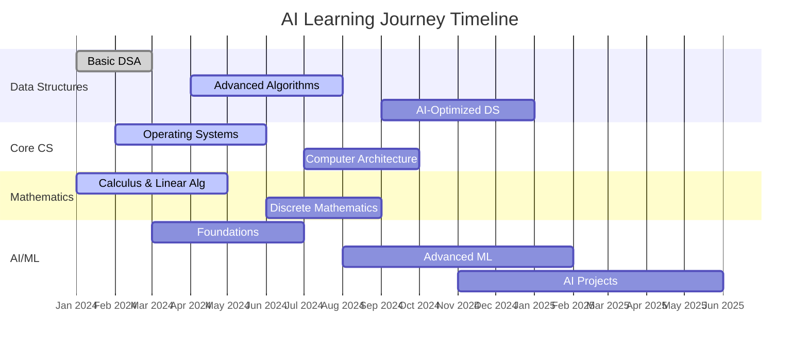
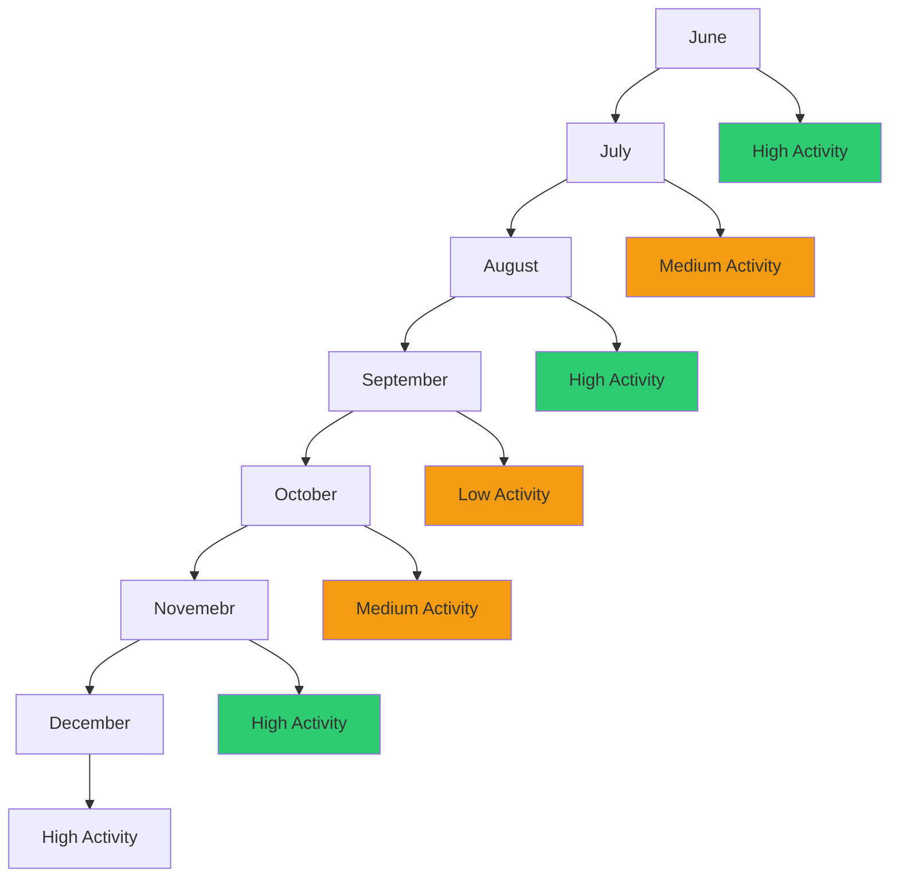
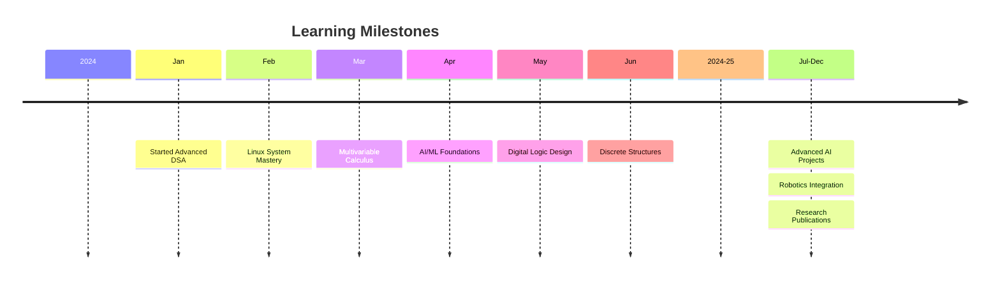
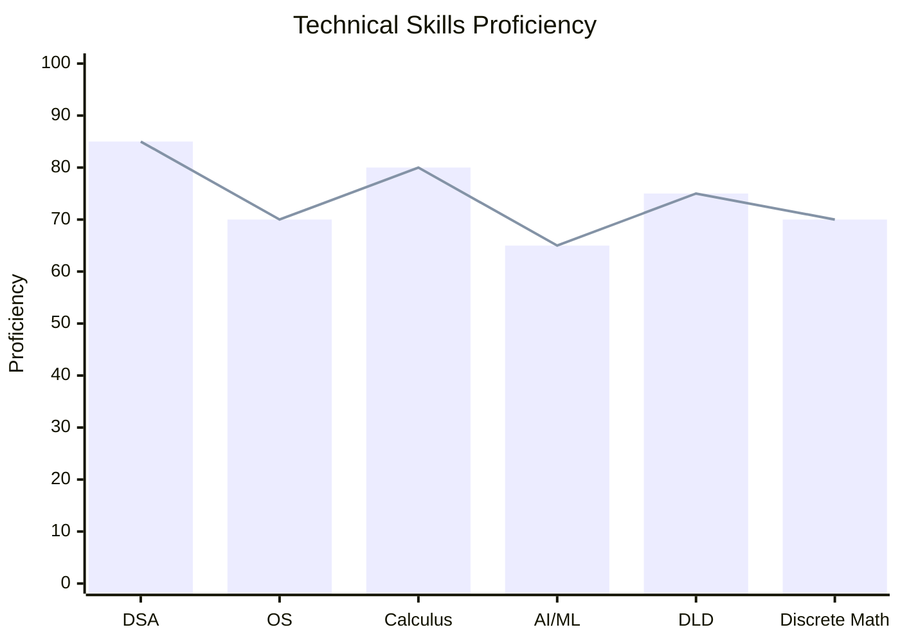
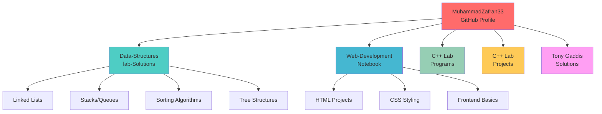
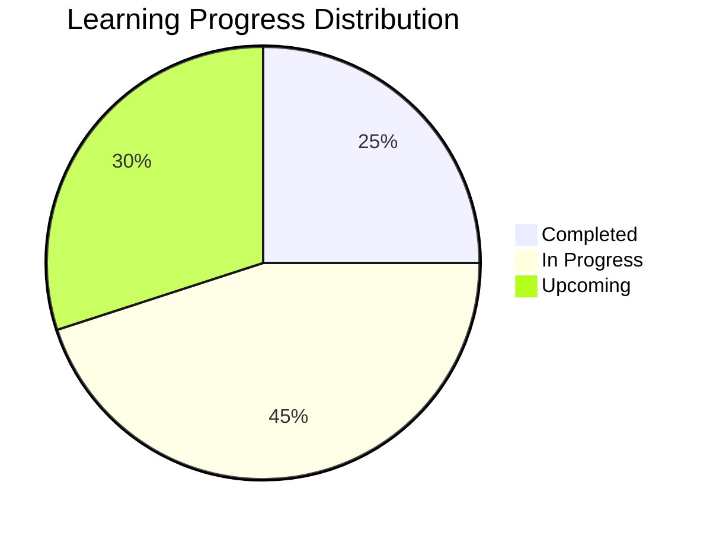
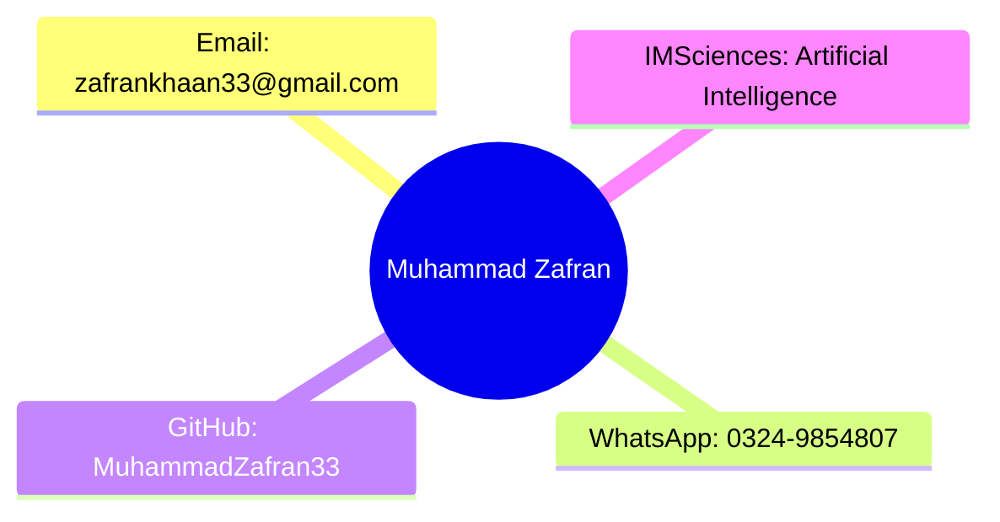

# 💫 Muhammad Zafran 
# *AI Visionary in the Making* 🤖

---

## 🎓 About Me
**3rd Semester Artificial Intelligence Student**  
🏛️ **Institute of Management Sciences (IMSciences), Peshawar**  
🌟 *Passionate about pushing the boundaries of intelligent systems*

---
## 🧠 AI Learning Journey

## 🎯 Mission & Vision
> **"Mastering fundamentals today to build intelligent systems tomorrow"**

### 🚀 Career Aspiration
**Become a leading engineer and innovator in AI and ML fields**

---

# 🎯 Academic Focus & Career Aspirations

Primary Interests: Machine Learning, Artificial Intelligence, and Robotics

Career Goal: To become a leading engineer and innovator in AI and ML fields

---

# 🔬 Current Focus & Deep Dives

I am actively engaged in deepening my knowledge in the following key areas:

## 🧠 Advanced Data Structures & Algorithms
- **Focus:** Designing and analyzing efficient solutions to complex computational problems.
- **Details:** Exploring graph algorithms, dynamic programming, greedy methods, and advanced tree structures (e.g., AVL, B-Trees). I'm honing my problem-solving skills to write optimized and scalable code.
- **Tools:** Primarily C++ and Python, with a strong emphasis on time/space complexity analysis.

## ⚙️ Operating Systems (Linux Environment)
- **Focus:** Understanding the bedrock of computing—how systems manage resources and execute programs.
- **Details:** Delving into process scheduling, memory management (paging, segmentation), concurrency, file systems, and inter-process communication (IPC). My practical environment is the Linux command line, where I explore these concepts hands-on.
- **Tools:** Linux (Bash scripting, kernel modules, system calls), C.

##  📈 Multivariable Calculus
- **Focus:** Building the mathematical language for understanding multi-dimensional systems and continuous change.
- **Details:** Mastering concepts like partial derivatives, multiple integrals, gradient vectors, and optimization. This forms the crucial mathematical backbone for the models in my AI/ML studies.
- **Applications:** Gradient descent in machine learning, 3D graphics, and physical simulations.

##  🤖 AI/ML Foundations
- **Focus:** Laying the groundwork for intelligent systems by understanding core theory and practice.
- **Details:** Studying fundamental machine learning models (linear/logistic regression, SVMs, decision trees), neural network architectures, and the mathematics of learning. I'm focused on building a strong conceptual foundation before diving into advanced frameworks.
- **Tools:** Python, NumPy, Pandas, Scikit-learn.

## 🔌 Digital Logic Design (DLD)
- **Focus:** Comprehending computing from the ground up—from transistors to processors.
- **Details:** Working with Boolean algebra, logic gates, combinational and sequential circuits (multiplexers, flip-flops), and finite state machines. This knowledge bridges the gap between abstract software and physical hardware.
- **Tools:** Logisim, Verilog/VHDL.

## 🕸️ Discrete Structures
- **Focus:** The mathematics of computer science—the language of logic, sets, and relations.
- **Details:** Applying principles of logic, proof techniques, graph theory, combinatorics, and recurrence relations. This is the essential toolkit for formal reasoning about algorithms and computational complexity.

# 📈 Contribution Activity

## 💡 The Synergy

I find the intersection of these fields fascinating. For instance:
*   **Algorithms & OS:** How does a scheduling algorithm impact system performance?
*   **Calculus & ML:** How do gradients guide a model's learning process?
*   **DLD & OS:** How is concurrency implemented at the hardware level?
*   **Discrete Math & Algorithms:** How do we formally prove an algorithm's

---

    
## 🛠️ Technical Skills & Proficiencies

💻 Programming Languages
Python - Primary language for AI/ML projects

C++ - Core language for data structures and system programming

Web Technologies - HTML, CSS for front-end development

## 🔧 Technical Domains

Data Structures & Algorithms - Strong foundation in problem-solving

Operating Systems - Linux system administration and programming

Computer Fundamentals - Comprehensive understanding of computer architecture

Mathematical Foundations - Multivariable calculus and linear algebra

---

# 🚀 Repository Purpose & Vision

🎯 Primary Objectives
Centralized Learning Hub: Organize all data structure lab solutions in one accessible location

Knowledge Reinforcement: Strengthen understanding of core computer science concepts through practical implementation

Collaborative Learning: Share solutions and insights with classmates and future students

Career Foundation: Build robust fundamentals for advanced studies in AI, machine learning, and algorithms

# 🌟 Long-term Vision
This repository represents my journey toward mastering the fundamental building blocks of computer science, essential for success in artificial intelligence and machine learning fields.

# 📚 Comprehensive Topics Coverage
✅ Completed Topics
Pointers & Dynamic Memory Allocation

malloc(), calloc(), realloc(), free()

new and delete operators in C++

Memory management best practices

Basic C++ Programs with Arrays

Array declaration and initialization

Multi-dimensional arrays

Array operations and algorithms

# 🎯 Current Progress Status

Linked Lists

Singly Linked Lists (implementation, traversal, operations)

Doubly Linked Lists (forward and backward traversal)

Circular Linked Lists (applications and implementations)

Stacks and Queues

Array-based implementations

Linked list-based implementations

Applications in problem-solving

---

## ⚙️ Installation & Setup Guide
Prerequisites
C++ Compiler (g++ recommended)

Git for version control

Code Editor (VS Code, CLion, or any preferred IDE)

---

# 🧑‍💻 Learning Outcomes & Objectives
## 🎯 Core Competencies Developed
Deep Understanding of Data Structures
Internal workings and memory management
Appropriate use cases for each structure
Efficiency trade-offs and considerations
Advanced Problem-Solving Skills
Algorithmic thinking and pattern recognition
Optimization techniques and efficiency analysis
Debugging and testing methodologies
C++ Programming Mastery
Memory management and pointers
Object-oriented programming concepts
Standard Template Library (STL) utilization
Mathematical Foundation
Complexity analysis and Big O notation
Recursive thinking and mathematical induction
Discrete mathematics applications.

## 🔬 Research & Development Skills
Code Documentation: Comprehensive commenting and explanation

Version Control: Professional Git usage and collaboration

Testing methodologies: Unit testing and validation approaches

## 📈 Future Development Roadmap
🎯 Short-term Goals (Current Semester)
Complete all lab assignments with detailed documentation

Add time complexity analysis for each algorithm

Include visual diagrams and flowcharts for complex structures

Create practice problem sets for each topic

## 🚀 Medium-term Goals (Next 6 Months)
Implement advanced AI-related data structures

Add Python implementations alongside C++

Create interactive visualization tools

Develop performance benchmarking suite

## 🌟 Long-term Vision (1 Year)
Expand to include machine learning algorithms

Add parallel computing implementations

Create comprehensive tutorial series

Integrate with AI project implementations

## 📋 Contribution Areas
Bug Fixes: Correct implementations and optimizations

Additional Solutions: Alternative approaches to problems

Documentation: Improved explanations and comments

Visual Aids: Diagrams, charts, and visual explanations

Test Cases: Comprehensive testing scenarios

---

# 🏆 Projects & Applications
## 🔬 Current Projects
Data Structures Visualizer - Interactive tool to visualize data structure operations

Algorithm Benchmark Suite - Performance comparison of different implementations

AI-Ready Data Structures - Optimized structures for machine learning applications

### 🎯 Planned Applications
Robotics Simulation: Data structures for robot navigation and planning

ML Pipeline Optimization: Efficient data handling for large datasets

Real-time Systems: Time-sensitive data structure implementations

# 📊 Progress Tracking
## 📈 Learning Metrics
Code Quality: Consistent commenting and documentation standards

Algorithm Efficiency: Focus on optimal time and space complexity

Problem-Solving Speed: Improved efficiency in tackling new challenges

Knowledge Depth: Comprehensive understanding of underlying principles

---

# 🎯 Success Indicators
✅ Complete implementation of all core data structures

✅ Thorough understanding of complexity analysis

✅ Ability to select appropriate structures for specific problems

✅ Preparation for advanced AI and algorithms courses

# 🙏 Acknowledgments & Gratitude
## 👨‍🏫 Academic Mentors
IMSciences Faculty - For exceptional guidance and quality education

Lab Instructors - For practical insights and hands-on learning

Department Heads - For creating a robust AI curriculum

## 👥 Collaborative Community
Classmates & Peers - For collaborative learning and knowledge sharing

Open Source Community - For invaluable resources and inspiration

Senior Students - For guidance and shared experiences

🌟 Special Thanks
To everyone who supported this educational journey and contributed to making this repository a comprehensive learning resource.

---
# 📜 License & Usage
## 📄 License Information
This repository is licensed under the Educational Purpose License - feel free to use, learn from, and modify the code for your educational journey.

### 🎯 Usage Guidelines
Educational Use: Encouraged for learning and academic purposes

Attribution: Please credit when referencing implementations

Non-commercial: Free for academic and personal use

Sharing Knowledge: Spread the learning and help others

---

# 📞 Connect With Me

🌟 "Mastering fundamentals today to build intelligent systems tomorrow" 🌟
This repository represents my commitment to excellence in computer science fundamentals and my journey toward becoming an AI expert.

⭐ If you find this repository helpful, please consider giving it a star! ⭐
---
---

