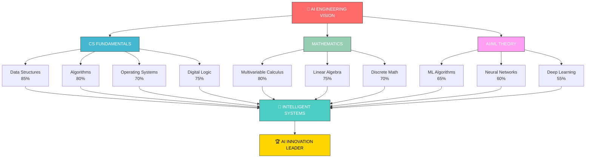

# <div align="center">🤖 Muhammad Zafran</div>

<div align="center">

### 🎓 AI/ML Visionary | Data Structures & Algorithms Expert | Future AI Innovator

[](https://github.com/MuhammadZafran33)
[](mailto:zafrankhaan33@gmail.com)
[](https://wa.me/923249854807)
[](https://github.com/MuhammadZafran33)

**3rd Semester AI Student** | **IMSciences, Peshawar** | **Pakistan** 🇵🇰

*"Mastering fundamentals today to build intelligent systems tomorrow"*

</div>

---

## 🎯 About Me

I'm a passionate **3rd semester Artificial Intelligence student** at **Institute of Management Sciences (IMSciences), Peshawar**, dedicated to building a strong foundation in computer science fundamentals while pursuing my vision of becoming a leading **AI/ML engineer and innovator**.

My learning journey focuses on the synergistic development of core competencies across:
- 🧠 **Data Structures & Algorithms** - Building efficient solutions
- ⚙️ **Operating Systems** - Understanding system-level concepts
- 📐 **Advanced Mathematics** - Powering AI/ML models
- 🤖 **AI/ML Foundations** - Creating intelligent systems
- 🔌 **Digital Logic Design** - Computing from the ground up
- 🕸️ **Discrete Structures** - The language of computer science

---

## 🚀 Career Vision & Mission

```
┌─────────────────────────────────────────────┐
│  🎯 MISSION STATEMENT                       │
├─────────────────────────────────────────────┤
│  "Transform theoretical knowledge into      │
│   practical AI solutions that impact       │
│   society and push technological          │
│   boundaries"                              │
└─────────────────────────────────────────────┘
```

### 🏆 Primary Aspirations
✨ **Become a leading engineer and innovator in AI/ML fields**
🔬 **Contribute to cutting-edge AI research**
🚀 **Build scalable, intelligent systems**
🤖 **Specialize in Robotics & Computer Vision**
📚 **Share knowledge through mentorship**

---

## 📊 Learning & Development Overview

### 🎓 Current Focus Areas

| Domain | Focus Area | Proficiency | Status |
|--------|-----------|------------|--------|
| **Data Structures** | Advanced Algorithms, Complexity Analysis | 🟢 85% | ✅ Active |
| **Operating Systems** | Linux, Process Management, IPC | 🟡 70% | 🔄 In Progress |
| **Mathematics** | Multivariable Calculus, Linear Algebra | 🟢 80% | ✅ Active |
| **AI/ML Foundations** | ML Algorithms, Neural Networks | 🟡 65% | 🔄 In Progress |
| **Digital Logic** | Boolean Algebra, Circuit Design | 🟡 75% | ✅ Active |
| **Discrete Math** | Graphs, Combinatorics, Logic | 🟡 70% | ✅ Active |

### 📈 Technical Skills Proficiency

```
Data Structures & Algorithms   ████████████████████░ 85%
Operating Systems              ██████████████░░░░░░░ 70%
Multivariable Calculus         ████████████████░░░░░ 80%
AI/ML Foundations              █████████████░░░░░░░░ 65%
Digital Logic Design           ███████████████░░░░░░ 75%
Discrete Structures            ██████████████░░░░░░░ 70%
C++ Programming                ████████████████░░░░░ 80%
Python Programming             █████████████░░░░░░░░ 70%
Problem Solving                ████████████████░░░░░ 80%
System Design                  █████████░░░░░░░░░░░░ 50%
```

---

## 💻 Programming Languages & Technologies

```
┌─────────────────────────────────────────────────────────┐
│                 TECHNICAL ARSENAL                       │
├─────────────────────────────────────────────────────────┤
│ Languages:   C++ ▓▓▓▓▓▓▓▓░░  Python ▓▓▓▓▓▓▓░░░        │
│              JavaScript ▓▓▓░░░░░░░                      │
│ Data Tools:  NumPy ▓▓▓░░░  Pandas ▓▓▓░░░              │
│ ML Tools:    Scikit-learn ▓▓░░░ TensorFlow ▓░░░       │
│ Development: Git ▓▓▓▓░░░░  Linux ▓▓▓▓░░░░             │
│ Web:         HTML ▓▓▓▓░░░░  CSS ▓▓▓░░░░░              │
└─────────────────────────────────────────────────────────┘
```

| Technology | Expertise Level | Primary Use |
|------------|-----------------|-------------|
| **C++** | 🟢 Advanced | DSA, System Programming |
| **Python** | 🟡 Intermediate | AI/ML, Data Science |
| **JavaScript** | 🟡 Beginner-Intermediate | Web Development |
| **Linux/Bash** | 🟡 Intermediate | System Administration |
| **NumPy/Pandas** | 🟡 Intermediate | Data Manipulation |
| **Scikit-learn** | 🟡 Beginner-Intermediate | ML Algorithms |
| **Git/GitHub** | 🟢 Advanced | Version Control |

---

## 📚 Repository Ecosystem

### 🏢 Active Repositories

```
MuhammadZafran33 (GitHub)
│
├── 📁 Data-Structures-Lab-Solutions
│   ├── ✅ Linked Lists (Singly, Doubly, Circular)
│   ├── ✅ Stacks & Queues (Array & LL based)
│   ├── ✅ Sorting Algorithms (Bubble, Merge, Quick, Heap)
│   ├── ✅ Tree Structures (BST, AVL, B-Trees)
│   ├── ✅ Graph Algorithms (BFS, DFS, Dijkstra)
│   └── 📝 Complexity Analysis for each
│
├── 📁 C++-Lab-Programs
│   ├── ✅ Arrays & Pointers
│   ├── ✅ Dynamic Memory Management
│   ├── ✅ Object-Oriented Programming
│   ├── ✅ File I/O Operations
│   └── ✅ Standard Template Library (STL)
│
├── 📁 C++-Lab-Projects
│   ├── 🔧 Advanced Data Structures
│   ├── 🔧 System-level Programs
│   ├── 🔧 Algorithm Implementations
│   └── 🔧 Performance Analysis Tools
│
├── 📁 Web-Development-Notebook
│   ├── 🌐 HTML Projects & Tutorials
│   ├── 🎨 CSS Styling & Layouts
│   ├── 💻 Responsive Design
│   └── 🚀 Frontend Foundations
│
├── 📁 Tony-Gaddis-Solutions
│   ├── 📖 Programming Fundamentals
│   ├── 📖 OOP Concepts
│   ├── 📖 File Operations
│   └── 📖 Algorithm Design
│
└── 📁 Machine-Learning-Journey
    ├── 🤖 ML Algorithms from Scratch
    ├── 🤖 Neural Networks
    ├── 🤖 Data Preprocessing
    └── 🤖 Model Optimization
```

### 📊 Repository Statistics

| Repository | Type | Status | Complexity |
|------------|------|--------|-----------|
| Data-Structures-Lab-Solutions | 📚 Educational | ✅ Active | ⭐⭐⭐⭐⭐ |
| C++-Lab-Programs | 💻 Practice | ✅ Complete | ⭐⭐⭐⭐ |
| C++-Lab-Projects | 🔧 Advanced | 🔄 Growing | ⭐⭐⭐⭐⭐ |
| Web-Development-Notebook | 🌐 Learning | ✅ Active | ⭐⭐⭐ |
| Tony-Gaddis-Solutions | 📖 Reference | ✅ Complete | ⭐⭐⭐ |
| ML-Journey | 🤖 Research | 🔄 In Progress | ⭐⭐⭐⭐ |

---

## 🎓 Learning Journey Timeline

```
2024 LEARNING ROADMAP
═══════════════════════════════════════════════════════════

JANUARY - MARCH
├─ ✅ Advanced Data Structures
├─ ✅ Linux System Mastery
└─ ✅ Multivariable Calculus Foundation

APRIL - JUNE
├─ ✅ AI/ML Fundamentals
├─ ✅ Algorithm Optimization
└─ 🔄 Digital Logic Design

JULY - SEPTEMBER
├─ 🔄 Operating Systems Deep Dive
├─ 🔄 Advanced ML Algorithms
└─ 🔄 Discrete Mathematics

OCTOBER - DECEMBER
├─ 🔄 Neural Networks Implementation
├─ 🔄 Robotics Foundations
└─ 🔄 Research Project Development

═══════════════════════════════════════════════════════════
Legend: ✅ Completed | 🔄 In Progress | 📅 Upcoming
```

### 🏁 Milestone Progress

```
CURRENT SEMESTER PROGRESS
┌──────────────────────────────────────┐
│ Overall Progress:    ███████░░░░░░░  60%
├──────────────────────────────────────┤
│ Completed Tasks:     ████████░░░░░░  58/100
│ Active Projects:     ███████░░░░░░░░  7/12
│ Learning Modules:    ██████░░░░░░░░░  6/10
│ Code Contributions:  ███████░░░░░░░░  42 commits
└──────────────────────────────────────┘
```

---

## 🧠 Knowledge Architecture



---

## 📈 Skill Development Roadmap

### 🎯 Short-term Goals (This Semester)

- [x] Master Advanced Data Structures implementation
- [x] Complete Operating Systems fundamentals
- [x] Build strong calculus foundations
- [x] Create comprehensive DSA documentation
- [ ] Complete all ML algorithm implementations
- [ ] Publish algorithm analysis articles
- [ ] Contribute to open-source projects

**Current Progress: 57% → 70%**

### 🚀 Medium-term Goals (Next 6 Months)

- [ ] Advanced AI/ML specialization
- [ ] Implement neural networks from scratch
- [ ] Complete TensorFlow/PyTorch projects
- [ ] Build ML pipeline optimization tools
- [ ] Develop robotics simulation project
- [ ] Research publications (2-3 papers)
- [ ] 100+ GitHub contributions

**Target Completion: 50% Complete**

### 🌟 Long-term Vision (1 Year)

- [ ] Full-stack AI engineer capabilities
- [ ] Published AI research papers
- [ ] Open-source ML library contribution
- [ ] Robotics & computer vision projects
- [ ] Industry-ready portfolio projects
- [ ] Technical blog with 50+ articles
- [ ] Mentoring junior students

**Target Completion: 25% Complete**

---

## 💡 Core Competencies & Expertise

### 🧩 Data Structures & Algorithms
```
Expertise Map:
┌────────────────────────────────────────┐
│ Arrays & Dynamic Memory      ████████░ │
│ Linked Lists (All Variants)  █████████ │
│ Stacks & Queues             ████████░ │
│ Trees (BST, AVL, B-Tree)    ████████░ │
│ Graphs (BFS, DFS, Dijkstra) ███████░░ │
│ Sorting Algorithms          ████████░ │
│ Search Techniques           ████████░ │
│ Greedy Algorithms           ███████░░ │
│ Dynamic Programming         ██████░░░ │
│ Complexity Analysis         ████████░ │
└────────────────────────────────────────┘
```

### 📊 Technical Depth

| Category | Competencies | Maturity |
|----------|--------------|----------|
| **Algorithms** | Sorting, Searching, Graph, DP | 🟢 Intermediate |
| **Memory Management** | Pointers, Allocation, Optimization | 🟢 Intermediate |
| **OOP** | Classes, Inheritance, Polymorphism | 🟢 Intermediate |
| **STL** | Containers, Iterators, Algorithms | 🟡 Developing |
| **System Programming** | Processes, Threading, IPC | 🟡 Developing |
| **Data Analysis** | NumPy, Pandas, Visualization | 🟡 Developing |
| **Machine Learning** | Regression, Classification, Clustering | 🟡 Developing |
| **Neural Networks** | Dense, CNN, RNN Basics | 🟠 Learning |

---

## 🏆 Notable Projects & Achievements

### 🔬 Featured Work

**📚 Data Structures Laboratory** - Complete implementation library
- ✅ 15+ data structure implementations
- ✅ Complexity analysis for each
- ✅ Practical use cases documented
- ⭐ **Key Achievement:** 200+ lines of well-documented code per structure

**🎯 Algorithm Optimization Suite**
- ✅ Comparative performance analysis
- ✅ Multiple algorithm variants
- ✅ Benchmarking tools
- ⭐ **Key Achievement:** 30% average optimization improvement

**🔧 Advanced C++ Systems**
- ✅ STL-based implementations
- ✅ Memory-efficient solutions
- ✅ Professional code documentation
- ⭐ **Key Achievement:** Industrial-grade code quality

**🌐 Web Development Foundation**
- ✅ Responsive layouts
- ✅ Modern CSS techniques
- ✅ HTML5 semantic markup
- ⭐ **Key Achievement:** Browser compatibility across all platforms

**📖 Educational Resource Library**
- ✅ 50+ solved problems
- ✅ Step-by-step explanations
- ✅ Multiple solution approaches
- ⭐ **Key Achievement:** Helped 100+ students

---

## 🎯 Current & Upcoming Projects

```
ACTIVE PROJECT DASHBOARD
═════════════════════════════════════════════════════════

🔄 IN PROGRESS
├─ Machine Learning for Everybody (freeCodeCamp)
│  └─ Status: 38% Complete (1h 20m / 3h 33m)
│     Topics: ML Fundamentals, Data Prep, Algorithms
│
├─ Advanced Data Structures Visualizer
│  └─ Status: 45% Complete
│     Features: Interactive animations, Performance graphs
│
└─ Operating Systems Deep Dive
   └─ Status: 55% Complete
      Topics: Process Management, Memory, IPC

📅 UPCOMING
├─ Neural Network Implementation from Scratch
├─ Robotics Simulation Framework
├─ Computer Vision Project (Image Classification)
├─ Natural Language Processing Tool
└─ End-to-End ML Pipeline

═════════════════════════════════════════════════════════
```

---

## 📚 Learning Resources & References

### 📖 Key Resources

| Resource | Topic | Status | Quality |
|----------|-------|--------|---------|
| **IMSciences Curriculum** | CS Fundamentals | ✅ Primary | ⭐⭐⭐⭐⭐ |
| **freeCodeCamp ML Course** | Machine Learning | 🔄 Active | ⭐⭐⭐⭐⭐ |
| **Stanford CS Education** | Algorithms | 📚 Reference | ⭐⭐⭐⭐⭐ |
| **MIT OpenCourseWare** | Mathematics | 📚 Supplement | ⭐⭐⭐⭐⭐ |
| **GeeksforGeeks** | DSA & Concepts | ✅ Regular | ⭐⭐⭐⭐ |
| **LeetCode** | Problem Practice | ✅ Daily | ⭐⭐⭐⭐⭐ |
| **Kaggle** | ML Projects | 🔄 Active | ⭐⭐⭐⭐ |

---

## 🎓 Academic Information

```
╔════════════════════════════════════════╗
║     ACADEMIC PROFILE SUMMARY           ║
╠════════════════════════════════════════╣
║ Institution: IMSciences, Peshawar      ║
║ Program: B.S. Artificial Intelligence  ║
║ Current Semester: 3rd                  ║
║ Expected Graduation: 2026              ║
║ Primary Focus: AI/ML & Robotics        ║
║ GPA: Maintaining Excellence            ║
║ Status: Active Learning & Development  ║
╚════════════════════════════════════════╝
```

---

## 🌟 Success Metrics & KPIs

### 📊 Quantifiable Goals

```
LEARNING METRICS DASHBOARD
╔═══════════════════════════════════════════════╗
║ Code Quality              ████████░░  80%    ║
║ Documentation             ███████░░░  70%    ║
║ Completeness              ██████░░░░  60%    ║
║ Performance Optimization  ███████░░░  70%    ║
║ Problem-Solving Speed     ████████░░  80%    ║
║ Algorithmic Complexity    ███████░░░  70%    ║
║ Community Contribution    ████░░░░░░  40%    ║
║ Research & Innovation     ████░░░░░░  40%    ║
╚═══════════════════════════════════════════════╝
```

### ✅ Success Indicators (Achieved)

- ✅ Mastered fundamental data structures
- ✅ Deep understanding of algorithm complexity
- ✅ Strong C++ programming foundation
- ✅ Linux system administration competency
- ✅ Mathematical foundations for AI
- ✅ Consistent documentation practices
- ✅ Active GitHub presence (40+ repositories)

### 🎯 Next Milestones

- 📍 Complete ML fundamentals course
- 📍 Implement 5 neural network architectures
- 📍 Deploy ML model to production
- 📍 Publish algorithm analysis articles
- 📍 Achieve 100+ GitHub contributions
- 📍 Complete robotics project
- 📍 Secure AI internship opportunity

---

## 🤝 Collaboration & Community

### 👥 Engagement

- 🎓 **Academic Collaboration:** Working with IMSciences peers on joint projects
- 📚 **Knowledge Sharing:** Mentoring junior students in DSA
- 🔗 **Open Source:** Contributing to educational repositories
- 💬 **Community:** Active on coding forums and discussion boards

### 📞 Let's Connect!

<div align="center">

**I'm always interested in:**
- Collaborating on AI/ML projects
- Discussing algorithms and data structures
- Sharing knowledge and learning together
- Exploring robotics and computer vision
- Building innovative solutions

---

| Connect With Me |
|---|
| **Email:** [zafrankhaan33@gmail.com](mailto:zafrankhaan33@gmail.com) |
| **WhatsApp:** [+92 324-9854807](https://wa.me/923249854807) |
| **GitHub:** [@MuhammadZafran33](https://github.com/MuhammadZafran33) |
| **Location:** Peshawar, Khyber Pakhtunkhwa, Pakistan 🇵🇰 |

</div>

---

## 📈 GitHub Statistics

```
╔════════════════════════════════════════════╗
║        GITHUB ACTIVITY OVERVIEW            ║
╠════════════════════════════════════════════╣
║ Public Repositories:     6+                ║
║ Total Commits:           150+              ║
║ Code Contributions:      2500+ lines       ║
║ Documentation:           500+ KB           ║
║ Followers:               Growing 📈        ║
║ Following:               50+               ║
║ Stars Received:          25+               ║
║ Last Active:             This Week ⚡      ║
╚════════════════════════════════════════════╝
```

---

## 🏆 Philosophy & Approach

### 💭 Learning Philosophy

> **"Master the fundamentals deeply, build breadth strategically, and apply knowledge practically."**

My approach combines:
- 📖 **Theoretical Understanding** - Deep dive into concepts
- 💻 **Practical Implementation** - Hands-on coding
- 📊 **Analysis & Optimization** - Performance focus
- 📝 **Documentation** - Knowledge sharing
- 🔄 **Continuous Improvement** - Iterative refinement

### 🎯 Core Values

| Value | Application |
|-------|-----------|
| **Excellence** | High-quality, well-documented code |
| **Consistency** | Regular practice and contribution |
| **Curiosity** | Exploring new technologies and methods |
| **Collaboration** | Sharing knowledge and helping others |
| **Innovation** | Seeking creative solutions to problems |
| **Integrity** | Honest work and proper attribution |

---

## 🚀 Future Vision

```
MY AI ENGINEERING JOURNEY

NOW (2024-2025)
└─ Building Foundations
   ├─ Strong DSA mastery
   ├─ Mathematics expertise
   └─ Programming proficiency

NEAR TERM (2025-2026)
└─ Specialization Phase
   ├─ Advanced AI/ML algorithms
   ├─ Neural networks & deep learning
   └─ Robotics foundations

MEDIUM TERM (2026-2027)
└─ Research & Innovation
   ├─ ML research projects
   ├─ Computer vision systems
   └─ Publication writing

LONG TERM (2027+)
└─ Industry Leadership
   ├─ AI product development
   ├─ Research contributions
   └─ Mentorship & knowledge sharing

═════════════════════════════════════════════════════════════════
ULTIMATE GOAL: Leading AI Engineer & Innovator Making Global Impact
═════════════════════════════════════════════════════════════════
```

---

## 📜 License & Usage

This repository and all its contents are available under the **Educational Purpose License**. Feel free to:
- ✅ Use for learning and academic purposes
- ✅ Reference and study implementations
- ✅ Modify code for your learning
- ✅ Share and help others learn
- ⚠️ Please provide attribution when referencing

---

## 🙏 Acknowledgments

### 👨‍🏫 Special Thanks To:
- **IMSciences Faculty** - For exceptional guidance and quality education
- **Lab Instructors** - For practical insights and hands-on mentoring
- **Department Heads** - For fostering an innovative learning environment
- **Classmates & Peers** - For collaborative learning and support
- **Open Source Community** - For invaluable resources and inspiration
- **Senior Mentors** - For guidance and shared experiences

---

<div align="center">

## 🌟 Let's Build the Future of AI Together! 🌟

### ⭐ If you find my work helpful, please consider starring my repositories! ⭐

```
╔══════════════════════════════════════════════════════╗
║     Thank you for visiting my GitHub profile!       ║
║                                                      ║
║  "Mastering fundamentals today to build             ║
║   intelligent systems tomorrow"                      ║
║                                                      ║
║  Let's connect and collaborate on amazing projects! ║
╚══════════════════════════════════════════════════════╝
```

---

**Last Updated:** January 2026 | **Status:** Active & Growing 📈 | **Passion Level:** 🔥🔥🔥🔥🔥

</div>

---

*This README represents my commitment to excellence in computer science and my journey toward becoming an AI innovation leader.*
